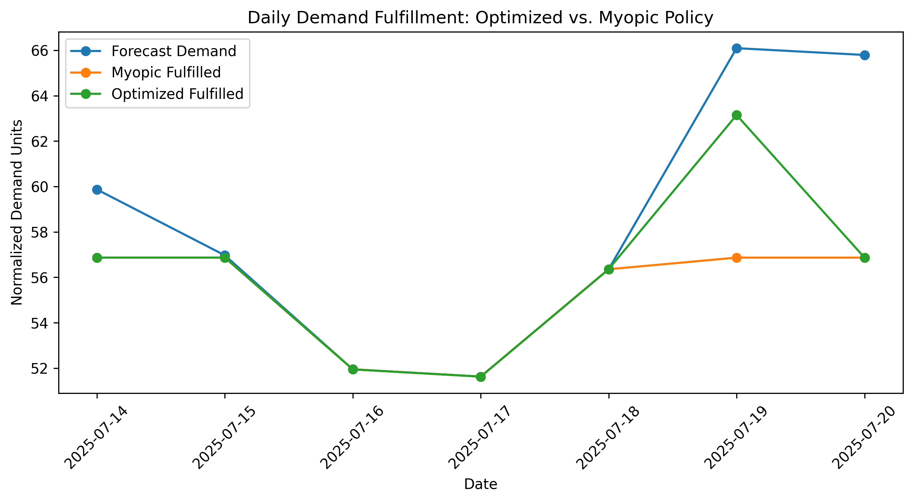
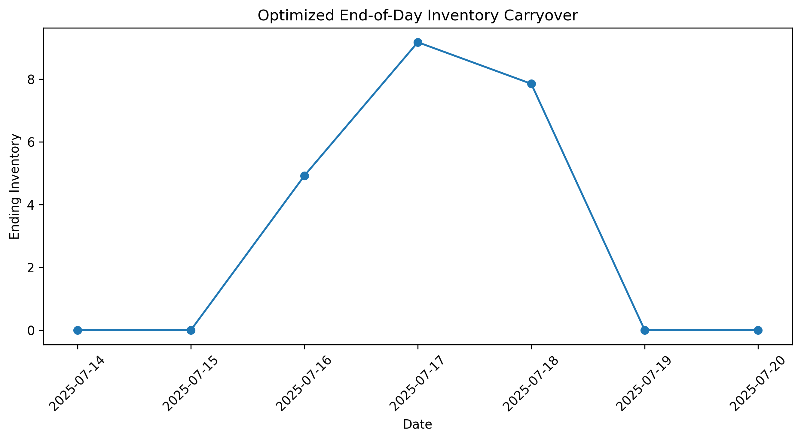
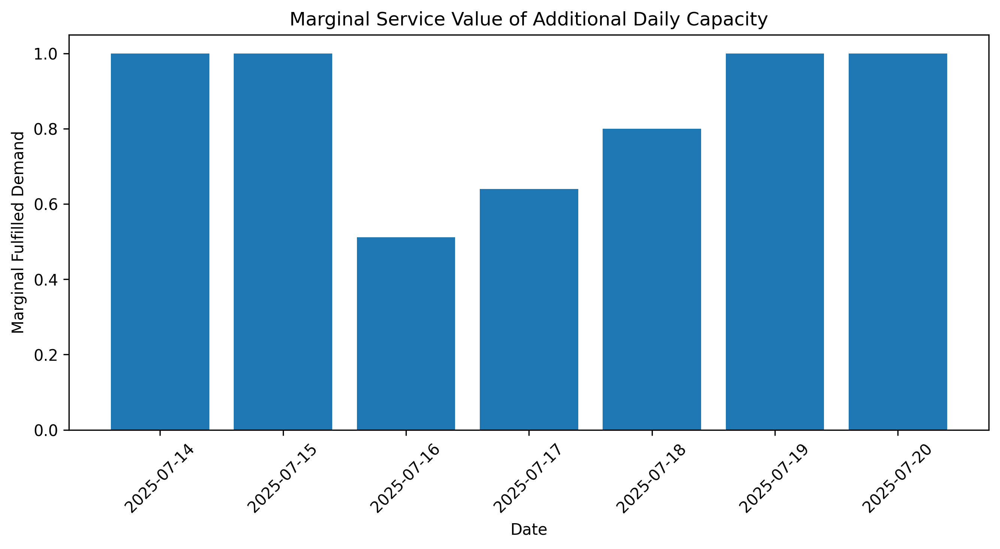

# Stockout-Aware Replenishment Optimization for Perishable Retail

An independent 2026 extension of prior academic work on retail pricing and
replenishment, focused on stockout-aware demand reconstruction and
multi-period replenishment optimization for perishable products.

The project uses the FreshRetailNet-LT public dataset and develops an
end-to-end workflow from demand-censoring diagnostics to a validated
seven-day linear optimization model.

## Project Overview

Observed sales may understate latent demand when products stock out. This
project therefore separates the demand-estimation problem from the downstream
replenishment decision problem.

The workflow consists of four main steps:

1. audit the retail panel and select a fixed study portfolio;
2. reconstruct stockout-censored demand and validate the recovery method;
3. generate leakage-free seven-day demand forecasts;
4. optimize replenishment across products and days under shared capacity and
   inventory-carryover constraints.

The final study population contains 25 products from Store 274 and uses
July 14–20, 2025 as the seven-day planning horizon.

## Key Results

### Stockout-Aware Demand Recovery

Observed sales are potentially censored on days with stockouts, so the demand
pipeline first reconstructs a stockout-aware demand proxy.

An initial product-weekday-hour median specification was rejected after
diagnostics showed instability for sparse hourly sales profiles. The final
method instead estimates product-weekday hourly demand shares from fully
uncensored historical days.

A hybrid recovery rule was selected through temporal pseudo-censoring
validation:

- hourly-share reconstruction when 1–12 operating hours are stockout-labeled;
- historical product-weekday mean demand under more severe censoring.

Recovered demand is constrained to be no lower than observed sales.

The final hybrid rule achieved approximately **13.8% WAPE** in the
pseudo-censoring experiment. Because true latent demand is not directly
observed on actual stockout days, these results are interpreted as validation
of a demand-reconstruction proxy rather than ground-truth latent-demand
accuracy.

### Demand Forecasting

A four-week weekday-mean forecasting rule was selected using leakage-free
rolling-origin validation. Recovery references used within each validation
fold were estimated using information available only before the corresponding
forecast origin.

The forecasting rule was fixed before the final July 14–20 holdout period was
evaluated.

On 81 fully uncensored store-product observations in the final holdout, the
forecast achieved approximately **26.8% WAPE**.

Across all 175 holdout observations, evaluation against the stockout-aware
recovered-demand proxy produced approximately **26.6% WAPE**.

The final forecasting model generates **175 demand inputs: 25 products × 7
days**.

### Multi-Period Replenishment Optimization

The final optimization model is a deterministic seven-day linear program with
three main product-day decision variables:

- replenishment quantity;
- fulfilled demand;
- usable end-of-day inventory.

Under the base planning scenario, total forecast demand is approximately
**408.66 normalized units**.

The Stage 1 maximum-service solution fulfills approximately **393.68
normalized demand units**, corresponding to a portfolio fill rate of
**96.34%**.

### Lexicographic Product Fairness

Maximizing aggregate service alone admits multiple optimal allocations and can
concentrate shortages unevenly across products.

In the unrestricted Stage 1 solution, weekly product fill rates range from
approximately **83.24% to 100%**.

A second lexicographic stage preserves the maximum aggregate service level
while maximizing the minimum weekly product-level fill rate.

This raises the minimum product fill rate from **83.24% to 96.34%** without
reducing total fulfilled demand.

The final decision rule is therefore:

$$
\text{maximum aggregate service}
\;\longrightarrow\;
\text{maximum minimum product service}.
$$

### Candidate Inventory Tie-Breaker

A candidate third objective minimizing total carried inventory was evaluated
after fixing both the Stage 1 service optimum and Stage 2 fairness optimum.

It did not reduce aggregate carried inventory.

In the base scenario, all seven daily replenishment-capacity constraints are
binding, total replenishment is fixed, aggregate service is fixed, initial
inventory is zero, and terminal inventory is zero. Under these conditions,
the aggregate inventory-carryover term is also fixed.

The candidate objective therefore selects a different product-day allocation
from the same optimal set rather than improving the aggregate inventory
profile.

It is retained as a modeling diagnostic but omitted from the final decision
rule.

### Value of Multi-Period Planning

The optimized plan is compared with a proportional same-day replenishment
policy that allocates capacity according to current-day demand but does not
build inventory in anticipation of future demand.

Under the base scenario, the myopic policy achieves:

- fulfilled demand: approximately **387.40 normalized units**;
- portfolio fill rate: approximately **94.80%**;
- unmet demand: approximately **21.25 normalized units**.

The optimized multi-period plan achieves:

- fulfilled demand: approximately **393.68 normalized units**;
- portfolio fill rate: approximately **96.34%**;
- unmet demand: approximately **14.97 normalized units**.

Relative to the myopic benchmark, multi-period optimization therefore:

- fulfills approximately **6.28 additional normalized demand units**;
- improves portfolio fill rate by approximately **1.54 percentage points**;
- reduces unmet forecast demand by approximately **29.6%**.

The entire service improvement occurs on July 19.

The optimized plan builds 7.85 normalized units of end-of-day inventory by
July 18. Under the base carryover assumption,

$$
0.80 \times 7.8518 \approx 6.2814,
$$

which exactly matches the additional July 19 demand fulfilled relative to the
same-day policy.

This provides a direct operational interpretation of the value of
anticipatory multi-period planning.





### Capacity Shadow Values

All seven daily replenishment-capacity constraints are binding in the base
scenario, but their marginal values differ across the planning horizon.

The local service shadow values are:

| Date | Shadow Value |
|---|---:|
| July 14 | 1.000 |
| July 15 | 1.000 |
| July 16 | 0.512 |
| July 17 | 0.640 |
| July 18 | 0.800 |
| July 19 | 1.000 |
| July 20 | 1.000 |

With a base inventory carryover factor of $\alpha = 0.80$, the intermediate
values satisfy

$$
0.8^3 = 0.512,
\qquad
0.8^2 = 0.640,
\qquad
0.8 = 0.800.
$$

These values reflect the reduced marginal service contribution of capacity
used several days before the later demand peak.

Finite-difference perturbations reproduce the solver dual values to numerical
precision.



### Capacity and Carryover Sensitivity

Daily replenishment-capacity scenarios are anchored to empirical quantiles of
historical recovered portfolio demand using only dates with complete
25-product coverage.

The balanced calibration period contains **193 days spanning July 11, 2024
through July 13, 2025**.

The capacity scenarios are:

| Scenario | Historical Quantile | Daily Capacity |
|---|---:|---:|
| Tight | 50th percentile | 53.37 |
| Base | 60th percentile | 56.87 |
| Adequate | 75th percentile | 62.85 |
| Relaxed | 90th percentile | 70.48 |

Inventory carryover is evaluated at **α = 0.60, 0.80, and 1.00**.

Portfolio fill rates are:

| Capacity Scenario | α = 0.60 | α = 0.80 | α = 1.00 |
|---|---:|---:|---:|
| Tight | 91.02% | 91.20% | 91.41% |
| Base | 95.60% | 96.34% | 97.41% |
| Adequate | 100% | 100% | 100% |
| Relaxed | 100% | 100% | 100% |

Better carryover improves service while capacity remains scarce, with the
largest effect in the intermediate base-capacity regime.

Once the 75th-percentile capacity scenario is reached, the fixed seven-day
forecast can be fully served under all tested carryover assumptions.

## Optimization Model

For product $i$ and day $t$, let

$$ x_{it} \ge 0 $$

denote replenishment arriving at the beginning of day $t$,

$$ s_{it} \ge 0 $$

denote fulfilled demand, and

$$ I_{it} \ge 0 $$

denote usable end-of-day inventory.

For the first planning day,

$$ I_{i1} = I_{i0} + x_{i1} - s_{i1}. $$

For subsequent days,

$$ I_{it} = \alpha I_{i,t-1} + x_{it} - s_{it}, \qquad t=2,\ldots,T. $$

Fulfilled demand satisfies

$$ 0 \le s_{it} \le d_{it}. $$

Daily replenishment is constrained by

$$ \sum_i x_{it} \le R_t. $$

### Stage 1: Maximum Service

The first stage solves

$$ S^* = \max \sum_i \sum_t s_{it}. $$

### Stage 2: Max-Min Fairness

For each product, define weekly forecast demand as

$$ D_i = \sum_t d_{it}. $$

The second stage preserves

$$ \sum_i \sum_t s_{it} = S^* $$

while maximizing $z$ subject to

$$ \sum_t s_{it} \ge zD_i, \qquad \forall i. $$

Thus $z$ represents the minimum weekly product-level fill rate guaranteed
across the portfolio.

The complete mathematical formulation and interpretation boundaries are
documented in
[`docs/model_specification.md`](docs/model_specification.md).

## Scenario Design

FreshRetailNet-LT does not directly provide the inventory and economic
quantities required for a retailer-specific replenishment optimization model,
including observed starting inventory, replenishment quantities, procurement
costs, or actual replenishment capacity.

Accordingly, these quantities are not inferred as retailer facts.

The base planning scenario uses:

- daily replenishment capacity: approximately **56.87 normalized units**;
- inventory carryover factor: **0.80**;
- initial usable inventory: **0**.

Capacity is anchored to the 60th percentile of recovered historical portfolio
demand during the balanced 25-product calibration period.

The carryover and initial-inventory values are explicit planning assumptions
and are varied or interpreted accordingly.

## Repository Structure

```text
.
├── data/
│   ├── raw/
│   │   ├── train.parquet
│   │   └── eval.parquet
│   ├── processed/
│   │   ├── study_portfolio.csv
│   │   ├── recovered_demand.csv
│   │   └── demand_forecast.csv
│   └── README.md
├── docs/
│   ├── dataset_notes.md
│   └── model_specification.md
├── figures/
│   ├── capacity_shadow_values.png
│   ├── daily_fulfillment_comparison.png
│   └── inventory_carryover.png
├── notebooks/
│   ├── 01_dataset_audit.ipynb
│   ├── 02_demand_analysis.ipynb
│   └── 03_optimization.ipynb
├── .gitignore
├── README.md
└── requirements.txt
```

Raw and processed data files are kept locally and excluded from version
control.

### `01_dataset_audit.ipynb`

Audits the dataset structure, temporal coverage, missingness, stockout
indicators, and store-product series characteristics.

It applies prespecified eligibility criteria, selects Store 274 based on the
largest eligible portfolio, and fixes all 25 eligible products at that store
as the study population.

The study population is fixed before downstream demand-recovery, forecasting,
and optimization outcomes are evaluated.

### `02_demand_analysis.ipynb`

Diagnoses the relationship between observed sales and stockout censoring,
develops the stockout-aware demand-recovery method, validates it through
temporal pseudo-censoring experiments, and constructs recovered historical
demand.

It then performs leakage-free rolling-origin forecast validation, fixes the
four-week weekday-mean forecasting rule, evaluates the untouched final
holdout, and generates the 175 final optimization demand inputs.

### `03_optimization.ipynb`

Constructs and validates the multi-period replenishment linear program,
implements the two-stage lexicographic efficiency-fairness decision rule,
examines the redundant inventory-minimization tie-breaker, validates capacity
shadow values using finite differences, performs capacity and carryover
sensitivity analysis, and benchmarks the optimized plan against a
proportional same-day policy.

## Data

This project uses the public FreshRetailNet-LT dataset.

Raw source parquet files are intentionally excluded from version control.

Processed project data are also excluded so that the repository documents the
full transformation pipeline rather than distributing derived data artifacts.

See [`data/README.md`](data/README.md) for data setup instructions and
[`docs/dataset_notes.md`](docs/dataset_notes.md) for the subset of dataset
fields used in the analysis.

## Reproducibility

The notebooks are designed to run sequentially:

```text
01_dataset_audit.ipynb
        ↓
02_demand_analysis.ipynb
        ↓
03_optimization.ipynb
```

`01_dataset_audit.ipynb` creates:

```text
data/processed/study_portfolio.csv
```

`02_demand_analysis.ipynb` creates:

```text
data/processed/recovered_demand.csv
data/processed/demand_forecast.csv
```

`03_optimization.ipynb` consumes the fixed demand forecast and reproduces the
optimization, validation, sensitivity, and benchmark results.

Python package requirements are listed in `requirements.txt`.

## Interpretation Boundary

All demand, replenishment, inventory, and capacity quantities in the
optimization model are expressed in normalized planning units.

The project does not claim to estimate:

- actual retailer procurement costs;
- actual retail prices or profits;
- actual replenishment capacity;
- actual starting inventory;
- actual spoilage or shelf-life parameters;
- deployed retailer decisions.

The stockout-aware reconstructed demand used on censored days is a validated
proxy rather than directly observed latent demand.

Capacity and carryover values are explicit planning assumptions used to study
the structure of the replenishment problem.

Reported improvements relative to the myopic benchmark are therefore
model-implied outcomes under the stated planning scenario rather than
observed business-performance gains.

## Background

This repository contains the independent 2026 extension only.

It builds on earlier academic work on linear-programming approaches to retail
pricing and replenishment, but the present project independently reconstructs
the empirical pipeline using a different public dataset, develops
stockout-aware demand inputs, implements leakage-free forecasting validation,
and focuses the optimization model on multi-period replenishment decisions.

The earlier work and its supporting materials are intentionally kept separate
from this repository so that the 2026 extension can be evaluated on its own
methodology, implementation, and results.